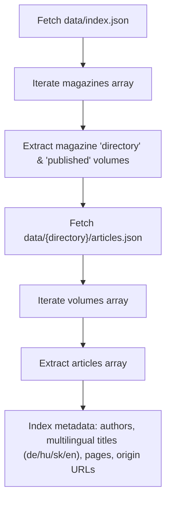
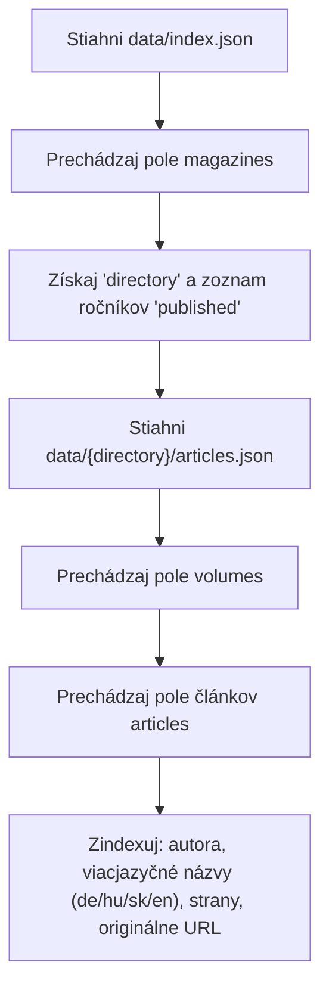

# English

# Data Specification & External UI Integration Guide

This document describes the structure of machine-readable metadata and instructions for external user interfaces, search engines, crawlers, and third-party applications consuming datasets from this repository.

---

## Direct HTTP & CDN Endpoints

Datasets are versioned and stored under the [`data/`](/data) directory. External frontends can fetch them directly from GitHub without cloning the repository.

### 1. Official GitHub Raw (CORS Enabled)
- **Publications Index (`index.json`)**:
  ```text
  https://raw.githubusercontent.com/RoboUlbricht/jahresbericht-der-koniglich/main/data/index.json
  ```
- **Articles Catalog (`articles.json`)**:
  ```text
  https://raw.githubusercontent.com/RoboUlbricht/jahresbericht-der-koniglich/main/data/{directory}/articles.json
  ```
  *Example:*
  `https://raw.githubusercontent.com/RoboUlbricht/jahresbericht-der-koniglich/main/data/jahresbericht/articles.json`

### 2. Fast Global CDN (jsDelivr)
Recommended for high-traffic web applications, frontend SPAs, and production consumers:
- **Publications Index**:
  ```text
  https://cdn.jsdelivr.net/gh/RoboUlbricht/jahresbericht-der-koniglich@main/data/index.json
  ```
- **Articles Catalog**:
  ```text
  https://cdn.jsdelivr.net/gh/RoboUlbricht/jahresbericht-der-koniglich@main/data/{directory}/articles.json
  ```

---

## Ingestion Workflow



1. **Step 1 — Discover Publications**: Fetch `data/index.json`. It provides the registry of magazines, their subdirectories (`directory`), and the list of published volumes (`published`) with links to digitized originals.
2. **Step 2 — Fetch Articles**: For each magazine, request `data/{directory}/articles.json`.
3. **Step 3 — Index & Display**: Parse article items, which contain multilingual titles, normalized author names, print and digital page references, and origin identifiers.

---

## Data Schemas

### 1. Publication Registry: `data/index.json`

```json
{
  "magazines": [
    {
      "title": "Jahresbericht der Königlich ungarischen Geologischen Reichsanstalt",
      "directory": "jahresbericht",
      "published": [
        {
          "year": 1883,
          "id": "V05aAAAAYAAJ",
          "origin": "https://www.google.sk/books/edition/_/V05aAAAAYAAJ",
          "bsb": false
        }
      ]
    }
  ]
}
```

#### Fields Description

| Field | Type | Description |
| :--- | :--- | :--- |
| `magazines[]` | `Array` | List of indexed geological publications |
| `magazines[].title` | `String` | Full original title of the journal / magazine |
| `magazines[].directory` | `String` | Subdirectory under `data/` containing the magazine's data and `articles.json` |
| `magazines[].published[]` | `Array` | List of digitized volumes available for this magazine |
| `published[].year` | `Number` | Publication year |
| `published[].id` | `String` | Unique volume identifier (Google Books volume ID, BSB ID, or custom slug) |
| `published[].origin` | `String` | Direct URL to original digitized source (Google Books, EPA OSZK, MDZ / BSB) |
| `published[].bsb` | `Boolean` | *(Optional)* Flag indicating whether the volume originates from Bayerische Staatsbibliothek |

---

### 2. Articles Catalog: `data/{directory}/articles.json`

```json
{
  "title": "Jahresbericht der Königlich ungarischen Geologischen Reichsanstalt",
  "volumes": [
    {
      "year": 1882,
      "articles": [
        {
          "author": "Dr. Carl Hofmann",
          "title_de": "Bericht über die im Sommer 1882 im südöstlichen Theile des Szathmárer Comitates ausgeführten geologischen Specialaufnahmen",
          "title_hu": "Jelentés a Szatmár vármegye délkeleti részében 1882 nyarán végzett részletes földtani felvételekről",
          "title_sk": "Správa o podrobnom geologickom mapovaní vykonanom v lete roku 1882 v juhovýchodnej časti Satmárskej župy",
          "title_en": "Report on the Detailed Geological Survey Carried out in the Southeastern Part of Szatmár County in the Summer of 1882",
          "language": "de",
          "page": 18,
          "pdf_id": "V05aAAAAYAAJ",
          "pdf_page": 23
        }
      ]
    }
  ]
}
```

#### Fields Description

| Field | Type | Description |
| :--- | :--- | :--- |
| `title` | `String` | Magazine title |
| `volumes[]` | `Array` | Volumes grouped by year |
| `volumes[].year` | `Number` | Year of the volume |
| `volumes[].articles[]` | `Array` | List of cataloged articles within this volume |
| `article.author` | `String` | Normalized author name (ALL-CAPS cleaned, particles preserved) |
| `article.title_de` | `String` | Article title in German (original or standard German) |
| `article.title_hu` | `String` | Article title in Hungarian |
| `article.title_sk` | `String` | Article title in Slovak |
| `article.title_en` | `String` | Article title in English |
| `article.language` | `String` | ISO code of the primary language of the original text (`de` or `hu`) |
| `article.page` | `Number` | Starting page number as printed in the original physical volume |
| `article.pdf_page` | `Number` | Starting page number in the digitized PDF / scan sequence (for direct deep linking) |
| `article.pdf_id` | `String` | Volume identifier matching `id` in `data/index.json` |

---

## Integration Example (JavaScript / TypeScript)

```javascript
const BASE_URL = 'https://raw.githubusercontent.com/RoboUlbricht/jahresbericht-der-koniglich/main/data';

async function fetchGeologicalIndex() {
  // 1. Fetch magazine registry
  const indexRes = await fetch(`${BASE_URL}/index.json`);
  if (!indexRes.ok) throw new Error(`Failed to load index.json: ${indexRes.status}`);
  const { magazines } = await indexRes.json();

  const articlesCatalog = [];

  // 2. Fetch articles for each magazine
  for (const mag of magazines) {
    try {
      const articlesRes = await fetch(`${BASE_URL}/${mag.directory}/articles.json`);
      if (!articlesRes.ok) continue;

      const articlesData = await articlesRes.json();
      const originMap = new Map((mag.published || []).map(p => [Number(p.year), p.origin]));

      for (const volume of articlesData.volumes || []) {
        const originUrl = originMap.get(Number(volume.year)) || null;

        for (const article of volume.articles || []) {
          articlesCatalog.push({
            magazineTitle: mag.title,
            magazineDirectory: mag.directory,
            year: volume.year,
            originUrl,
            ...article,
          });
        }
      }
    } catch (err) {
      console.warn(`Error loading articles for ${mag.directory}:`, err);
    }
  }

  return articlesCatalog;
}

// Example usage:
fetchGeologicalIndex().then(articles => {
  console.log(`Loaded ${articles.length} cataloged articles.`);
});
```

---

<br>

# Slovenčina

# Dátová špecifikácia a inštrukcie pre externé UI

Tento dokument opisuje štruktúru strojovo čitateľných metadát a inštrukcie pre externé používateľské rozhrania, vyhľadávače, roboty a aplikácie tretích strán, ktoré chcú indexovať a konzumovať dáta z tohto repozitára na GitHube.

---

## Prístupové HTTP & CDN adresy

Všetky datasety sú verzované a uložené v adresári [`data/`](/data). Externé frontendy môžu súbory sťahovať priamo cez HTTP bez nutnosti klonovať repozitár.

### 1. Oficiálny GitHub Raw (s podporou CORS)
- **Index publikácií (`index.json`)**:
  ```text
  https://raw.githubusercontent.com/RoboUlbricht/jahresbericht-der-koniglich/main/data/index.json
  ```
- **Katalóg článkov (`articles.json`)**:
  ```text
  https://raw.githubusercontent.com/RoboUlbricht/jahresbericht-der-koniglich/main/data/{directory}/articles.json
  ```
  *Príklad:*
  `https://raw.githubusercontent.com/RoboUlbricht/jahresbericht-der-koniglich/main/data/jahresbericht/articles.json`

### 2. Rýchla globálna CDN (jsDelivr)
Vhodné pre produkčné SPA aplikácie s vysokou návštevnosťou a efektívnym cacheovaním:
- **Index publikácií**:
  ```text
  https://cdn.jsdelivr.net/gh/RoboUlbricht/jahresbericht-der-koniglich@main/data/index.json
  ```
- **Katalóg článkov**:
  ```text
  https://cdn.jsdelivr.net/gh/RoboUlbricht/jahresbericht-der-koniglich@main/data/{directory}/articles.json
  ```

---

## Proces indexácie pre externé UI



1. **Krok 1 — Objavovanie publikácií**: Stiahnutie `data/index.json`. Obsahuje zoznam časopisov, ich podadresáre (`directory`) a zoznam ročníkov (`published`) s odkazmi na digitalizáty.
2. **Krok 2 — Stiahnutie článkov**: Pre každý časopis sa pošle požiadavka na `data/{directory}/articles.json`.
3. **Krok 3 — Indexácia a zobrazenie**: Spracovanie položiek článkov, ktoré obsahujú viacjazyčné názvy, normalizované mená autorov, čísla strán v tlači i v PDF a odkaz na originál.

---

## Dátové schémy

### 1. Zoznam publikácií a ročníkov: `data/index.json`

```json
{
  "magazines": [
    {
      "title": "Jahresbericht der Königlich ungarischen Geologischen Reichsanstalt",
      "directory": "jahresbericht",
      "published": [
        {
          "year": 1883,
          "id": "V05aAAAAYAAJ",
          "origin": "https://www.google.sk/books/edition/_/V05aAAAAYAAJ",
          "bsb": false
        }
      ]
    }
  ]
}
```

#### Popis polí

| Pole | Typ | Popis |
| :--- | :--- | :--- |
| `magazines[]` | `Array` | Zoznam indexovaných geologických publikácií |
| `magazines[].title` | `String` | Pôvodný úplný názov časopisu / ročenky |
| `magazines[].directory` | `String` | Názov podadresára v priečinku `data/`, kde sa nachádzajú dáta a `articles.json` |
| `magazines[].published[]` | `Array` | Zoznam dostupných digitalizovaných ročníkov |
| `published[].year` | `Number` | Rok vydania ročníka |
| `published[].id` | `String` | Unikátny identifikátor digitalizátu (Google Books ID, BSB kód, skratka) |
| `published[].origin` | `String` | URL odkaz na pôvodný digitalizovaný zdroj (Google Books, EPA OSZK, MDZ / BSB) |
| `published[].bsb` | `Boolean` | *(Voliteľné)* Príznak, či zväzok pochádza z mníchovskej knižnice (BSB) |

---

### 2. Katalóg článkov: `data/{directory}/articles.json`

```json
{
  "title": "Jahresbericht der Königlich ungarischen Geologischen Reichsanstalt",
  "volumes": [
    {
      "year": 1882,
      "articles": [
        {
          "author": "Dr. Carl Hofmann",
          "title_de": "Bericht über die im Sommer 1882 im südöstlichen Theile des Szathmárer Comitates ausgeführten geologischen Specialaufnahmen",
          "title_hu": "Jelentés a Szatmár vármegye délkeleti részében 1882 nyarán végzett részletes földtani felvételekről",
          "title_sk": "Správa o podrobnom geologickom mapovaní vykonanom v lete roku 1882 v juhovýchodnej časti Satmárskej župy",
          "title_en": "Report on the Detailed Geological Survey Carried out in the Southeastern Part of Szatmár County in the Summer of 1882",
          "language": "de",
          "page": 18,
          "pdf_id": "V05aAAAAYAAJ",
          "pdf_page": 23
        }
      ]
    }
  ]
}
```

#### Popis polí

| Pole | Typ | Popis |
| :--- | :--- | :--- |
| `title` | `String` | Názov časopisu |
| `volumes[]` | `Array` | Zoznam ročníkov usporiadaných podľa rokov |
| `volumes[].year` | `Number` | Rok vydania ročníka |
| `volumes[].articles[]` | `Array` | Zoznam katalogizovaných článkov v danom ročníku |
| `article.author` | `String` | Normalizované meno autora (očistené ALL-CAPS, zachované tituly a šľachtické častice) |
| `article.title_de` | `String` | Názov článku v nemčine |
| `article.title_hu` | `String` | Názov článku v maďarčine |
| `article.title_sk` | `String` | Názov článku v slovenčine |
| `article.title_en` | `String` | Názov článku v angličtine |
| `article.language` | `String` | Kód pôvodného jazyka textu článku (`de` alebo `hu`) |
| `article.page` | `Number` | Číslo strany v pôvodnom tlačenom zväzku |
| `article.pdf_page` | `Number` | Číslo strany v PDF / digitalizáte (vhodné pre priamy skok na stranu) |
| `article.pdf_id` | `String` | Identifikátor ročníka zhodný s `id` v `data/index.json` |

---

## Príklad integrácie (JavaScript / TypeScript)

```javascript
const BASE_URL = 'https://raw.githubusercontent.com/RoboUlbricht/jahresbericht-der-koniglich/main/data';

async function fetchGeologicalIndex() {
  // 1. Získanie zoznamu časopisov
  const indexRes = await fetch(`${BASE_URL}/index.json`);
  if (!indexRes.ok) throw new Error(`Chyba pri sťahovaní index.json: ${indexRes.status}`);
  const { magazines } = await indexRes.json();

  const articlesCatalog = [];

  // 2. Načítanie článkov pre každý časopis
  for (const mag of magazines) {
    try {
      const articlesRes = await fetch(`${BASE_URL}/${mag.directory}/articles.json`);
      if (!articlesRes.ok) continue;

      const articlesData = await articlesRes.json();
      const originMap = new Map((mag.published || []).map(p => [Number(p.year), p.origin]));

      for (const volume of articlesData.volumes || []) {
        const originUrl = originMap.get(Number(volume.year)) || null;

        for (const article of volume.articles || []) {
          articlesCatalog.push({
            magazineTitle: mag.title,
            magazineDirectory: mag.directory,
            year: volume.year,
            originUrl,
            ...article,
          });
        }
      }
    } catch (err) {
      console.warn(`Nepodarilo sa načítať články pre ${mag.directory}:`, err);
    }
  }

  return articlesCatalog;
}

// Príklad spustenia:
fetchGeologicalIndex().then(articles => {
  console.log(`Načítaných ${articles.length} katalogizovaných článkov.`);
});
```
